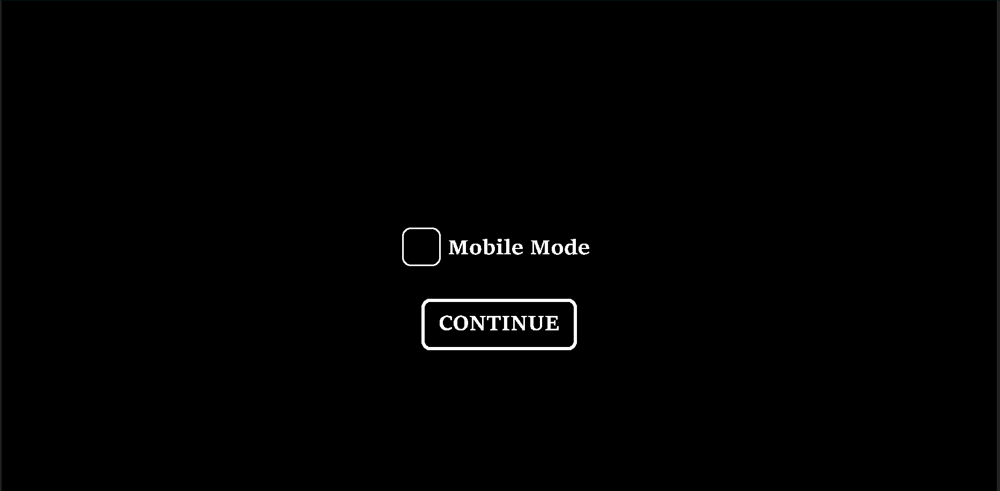
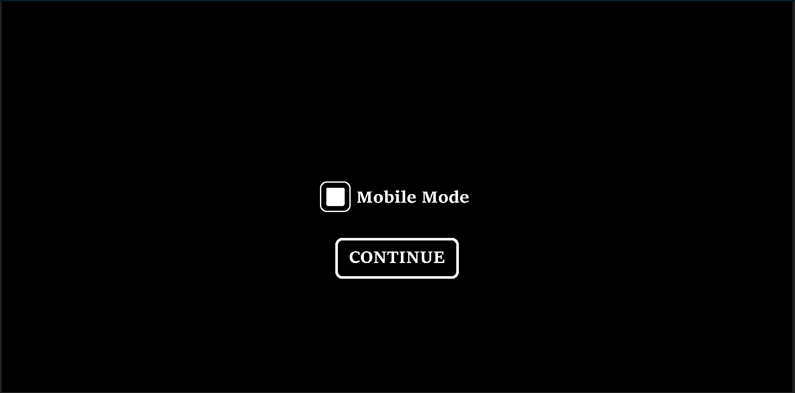
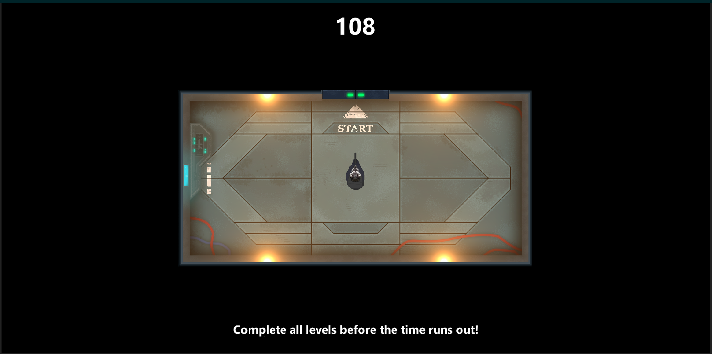
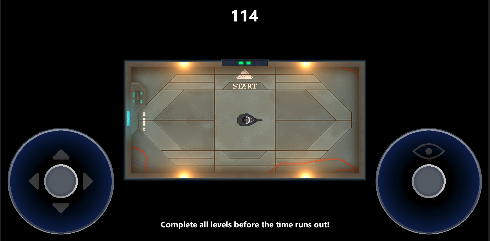
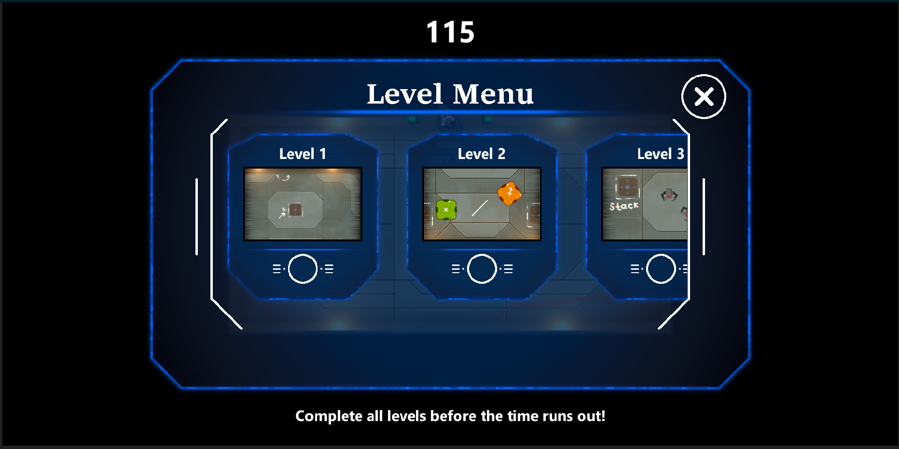

# ptp2022-6-2d-game

## *Инструкция по запуску 2D игры - Uninvited Guests*

Для запуска игры необходимо перейти на наш сайт [QualityWorkStudio](https://qualityworkstudio.ru "Перейти к сайту") и нажать "Play Game". Далее вам необходимо выбрать режим игры

Чтобы продолжить на компьюторе, достаточно нажать на "CONTINUE".

Чтобы продолжить на мобильом устройстве, необходимо выбрать "Mobile Mode", а только потом нажать на "CONTINUE".

Затем откроется карта с игроком. Вам надо будет проследовать к выходу с помощью:
1. кнопок управление WASD на компьюторе 

2. джойстика на мобильном устройстве 

Далее откроется меню с выбором уровня 
Выбираем и играем)

## Участники проекта
* *Караник Андрей Алексадрович* - [@Andrey-Karanik](https://github.com/Andrey-Karanik "Перейти на GitHub Караника А.А")
* Терюхов Богдан Андреевич - [@BogdanTeryukhov](https://github.com/BogdanTeryukhov "Перейти на GitHub Терюхова Б.А")
* Джабаров Рауль Асипович - [@xb0yx2k20](https://github.com/xb0yx2k20 "Перейти на GitHub Джабарова Р.А")

